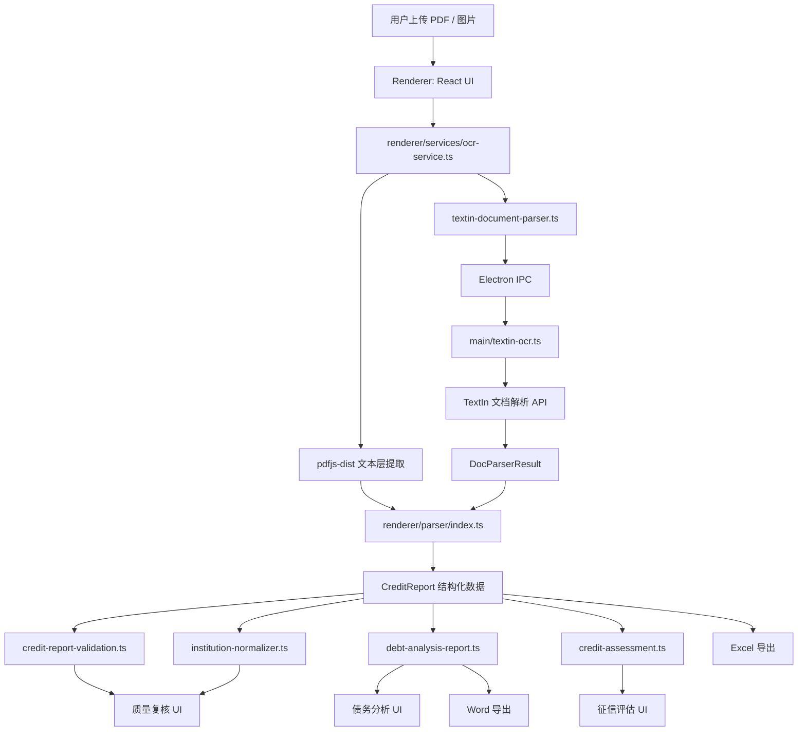

# 桌面版技术架构与安卓移动端转型蓝图

> 面向新项目复制与移动端转型使用。  
> 当前项目：LoanIntelligence Parser，征信报告解析系统。  
> 当前日期：2026-06-07。

## 1. 文档目标

本文档用于在新项目中复用当前桌面端项目的核心能力，并规划安卓移动端 App 的技术路线。

核心结论：

- 当前项目的解析、校验、机构归一化、债务分析等核心业务代码具备较高复用价值。
- 当前 UI 与平台能力明显偏桌面端，移动端不应照搬桌面界面。
- 安卓项目建议优先采用 React + TypeScript + Capacitor 路线，保留 Web 技术栈与业务代码复用能力。
- 移动端产品定位建议为“外勤快速采集、快速识别、关键复核、债务结论查看”，桌面端继续承担复杂核对、完整明细和重度导出。

## 2. 当前项目定位

当前项目是一个 Electron 桌面端征信报告解析工具，面向助贷、信贷顾问和贷前审核场景。

用户上传央行二代个人征信报告 PDF 或图片后，系统完成：

- PDF 文本层提取或 OCR 文档解析。
- 征信报告结构化解析。
- 账户、查询记录、授信协议、还款责任等业务数据提取。
- 字段与金额一致性校验。
- 机构名称归一化与机构库匹配。
- OCR 质量诊断与人工复核。
- 债务分析、征信评估、Excel/Word 导出。

项目核心目标不是“把图片变成文字”，而是把征信报告转换为可校验、可编辑、可分析、可导出的业务数据。

## 3. 当前技术栈

| 层级 | 当前技术 |
| --- | --- |
| 桌面框架 | Electron 40.x |
| 前端框架 | React 19.x |
| 语言 | TypeScript 5.9 |
| UI 组件 | Ant Design 6.x |
| 样式 | Tailwind CSS 4.x |
| 构建 | Vite 7.x |
| PDF 文本提取 | pdfjs-dist 5.x |
| 扫描件/图片 OCR | TextIn 文档解析 API |
| LLM 分析 | DeepSeek API |
| 本地密钥 | Electron userData + safeStorage |
| OCR 缓存 | Electron userData/doc-parser-cache |
| 本地数据 | localStorage，lowdb 仅保留在冷宫产品库 |
| Excel/Word 导出 | 手写 OpenXML，fflate 打包 |
| 打包 | electron-builder，Windows NSIS |

## 4. 当前项目目录结构

```text
src/
├── main/
│   ├── index.ts
│   ├── preload.ts
│   ├── textin-ocr.ts
│   ├── deepseek-client.ts
│   ├── api-key-store.ts
│   ├── doc-parser-cache.ts
│   └── logger.ts
│
├── renderer/
│   ├── App.tsx
│   ├── main.tsx
│   ├── components/
│   │   ├── PdfViewer.tsx
│   │   ├── CreditReportTabs.tsx
│   │   ├── SetupModal.tsx
│   │   └── tabs/
│   ├── parser/
│   ├── services/
│   ├── data/
│   ├── types/
│   ├── config/
│   ├── styles/
│   └── utils/
│
└── shared/
    ├── doc-parser-types.ts
    └── ocr-types.ts
```

## 5. 当前运行架构



## 6. 主进程模块关系

| 模块 | 位置 | 职责 | 移动端复用判断 |
| --- | --- | --- | --- |
| Electron 窗口 | `src/main/index.ts` | 创建窗口、注册 IPC | 不复用 |
| Preload | `src/main/preload.ts` | 暴露安全的 `window.electron` API | 不复用，但接口思想复用 |
| TextIn OCR | `src/main/textin-ocr.ts` | 调用 TextIn，将返回结果转成内部结构 | 逻辑可迁移到 Android 平台层 |
| DeepSeek | `src/main/deepseek-client.ts` | LLM 调用封装 | 可迁移到平台层 |
| 密钥存储 | `src/main/api-key-store.ts` | 本地保存 API Key | 不直接复用，安卓改用安全存储 |
| OCR 缓存 | `src/main/doc-parser-cache.ts` | 按文件 hash 缓存 OCR 结果 | 思路复用，存储实现替换 |
| 日志 | `src/main/logger.ts` | 主进程日志 | 按新平台重写 |

## 7. 渲染端核心模块关系

| 模块 | 位置 | 职责 | 移动端复用判断 |
| --- | --- | --- | --- |
| 应用壳 | `src/renderer/App.tsx` | 桌面导航、状态栏、工作区切换 | 不建议复用 UI |
| 文件预览 | `components/PdfViewer.tsx` | PDF/图片上传、预览、旋转、放大镜、页序调整 | 部分逻辑可参考，UI 需重做 |
| 数据页容器 | `components/CreditReportTabs.tsx` | 报告页面组织与页签切换 | 不建议直接复用 |
| 质量复核 | `components/tabs/OcrQualityTab.tsx` | 校验、机构、图片质量、候选版本 | 业务展示逻辑可参考，移动端重做交互 |
| 征信明细 | `components/tabs/CreditDetailTab.tsx` | 大表格编辑账户字段 | 手机端不应照搬，改卡片列表 |
| 债务分析 | `components/tabs/DebtAnalysisReportTab.tsx` | 债务总览、方案、AI 分析、Word 导出 | 计算逻辑复用，UI 重做 |
| 征信评估 | `components/tabs/CreditAssessmentTab.tsx` | 六维度事实画像、AI 点评 | 逻辑可复用，UI 简化 |
| 溯源 | `components/tabs/ProvenanceTab.tsx` | 字段来源追踪 | 移动端可作为详情入口 |

## 8. 核心数据结构

### 8.1 CreditReport

`CreditReport` 是当前项目最重要的领域模型。

它包含：

- `header`：报告头信息。
- `personalInfo`：身份信息。
- `summary`：信息概要。
- `creditDetail`：信贷交易明细。
- `accountDerived`：从账户反算的分类汇总。
- `accountBriefs`：账户简要列表。
- `queryRecord`：机构查询和本人查询。
- `repayResponsibilities`：相关还款责任。
- `creditAgreements`：授信协议信息。
- `provenance`：字段来源。

移动端应继续以 `CreditReport` 为主数据模型，不建议重新设计一套业务字段。

### 8.2 DocParserResult

`DocParserResult` 是 OCR 文档解析后的统一中间层。

它用于屏蔽不同来源：

- TextIn 文档解析结果。
- PDF 文本层。
- 图片 OCR。
- 多候选 OCR。
- 多页图片合并。

移动端应保留该中间层。相机、相册、文件选择只是输入方式变化，不应影响后续解析器。

### 8.3 OcrDiagnosticsReport

质量复核的数据来源：

- 图片质量诊断。
- OCR 候选版本。
- 字段与金额校验。
- 机构库匹配结果。

移动端第一版建议只展示：

- 高风险字段。
- 需复核字段。
- 疑似机构或未收录机构。
- 图片模糊、尺寸过低等用户可处理的问题。

不建议展示偏技术的结构锚点、表格命中、查询编号连续性等内容。

## 9. 当前核心数据流

```text
文件输入
  -> ocr-service
  -> 判断 PDF 文本层是否可用
  -> 可用: pdfjs 提取 fullText
  -> 不可用: TextIn 文档解析
  -> DocParserResult / fullText
  -> OCR 纠错与页面重排
  -> parseCreditReport
  -> normalizeCreditReportInstitutions
  -> validateCreditReportData
  -> buildDebtAnalysisReport / assessCredit
  -> UI 展示与导出
```

## 10. OCR 实现细节

当前 OCR 调度位于 `renderer/services/ocr-service.ts`。

关键能力：

- 单 PDF 上传。
- 单图片上传。
- 多图片合并为一份报告。
- 电子 PDF 优先尝试文本层。
- 文本层弱时回退 OCR。
- 图片质量评估。
- 图片预处理候选。
- OCR 多候选评分。
- 候选表格融合。
- 页面重排。
- OCR 错字纠正。
- 字段和金额校验。

安卓项目应优先复用这些能力，但要替换平台入口：

- 文件读取。
- 相机拍照。
- base64 转换。
- 本地缓存。
- 密钥读取。
- 网络请求。

## 11. 解析器实现细节

解析器入口：`src/renderer/parser/index.ts`。

主要步骤：

1. 区块识别：识别报告一级、二级模块。
2. 表格抽取：从 `DocParserResult` 中抽取 Markdown 表格。
3. 表格分类：报告头、身份信息、账户、查询记录、授信协议等。
4. 章节定位：根据 layout 与表格上下文识别左右栏、跨页、续表。
5. 账户分组：非循环贷、循环贷一、循环贷二、贷记卡、还款责任、授信协议。
6. 字段提取：各 `block-parsers` 解析具体字段。
7. 派生画像：生成 `ClientProfile` 与债务分析所需结构。

移动端建议完整复用解析器，避免重新开发征信字段规则。

## 12. 当前 UI 功能地图

| 页面 | 当前功能 | 移动端建议 |
| --- | --- | --- |
| 文件解析 | 上传 PDF/图片，预览，旋转，多图排序 | 重做为拍照/相册/文件入口 |
| 质量复核 | 字段、金额、机构、图片质量、候选版本 | 保留关键待办，删掉技术诊断 |
| 债务分析 | 债务总额、月供、结构、方案、AI 分析 | 作为移动端核心结果页 |
| 征信明细 | 多类账户大表格，字段可编辑 | 改为账户卡片列表 + 详情编辑 |
| 查询记录 | 机构查询、本人查询表格 | 简化为查询次数和异常提示 |
| 征信评估 | 六维度事实画像，AI 点评 | 保留摘要和风险标签 |
| 字段溯源 | 字段来源表格 | 做成问题详情中的“来源”入口 |

## 13. 当前项目可复用资产

### 13.1 高价值复用

- `src/renderer/parser/`
- `src/renderer/services/credit-report-validation.ts`
- `src/renderer/services/institution-normalizer.ts`
- `src/renderer/services/debt-analysis-report.ts`
- `src/renderer/services/analysis-readiness.ts`
- `src/renderer/services/credit-profile-builder.ts`
- `src/renderer/services/credit-assessment.ts`
- `src/renderer/parser/ocr-quality.ts`
- `src/renderer/types/`
- `src/shared/`
- 测试 fixture 与 parser tests。

### 13.2 部分复用

- `src/renderer/services/ocr-service.ts`
- `src/renderer/services/textin-document-parser.ts`
- `src/renderer/services/image-quality.ts`
- `src/renderer/services/image-preprocess.ts`
- `src/renderer/services/pdf-to-image.ts`
- `src/renderer/services/excel-export.ts`
- `src/renderer/services/debt-analysis-docx-export.ts`

这些文件的业务意图可复用，但平台调用、文件读写、浏览器 API、Electron API 需要重构。

### 13.3 不建议直接复用

- `src/main/` 的 Electron 专属入口。
- `App.tsx` 的桌面布局。
- Ant Design 桌面表格密集型页面。
- `PdfViewer` 的桌面预览交互。
- `SetupModal` 的桌面密钥录入形态。

## 14. 安卓移动端产品定位

移动端不应定位为“桌面版等比例搬迁”，而应定位为：

```text
外勤采集工具 + 快速征信解析 + 关键复核 + 债务结论查看
```

第一版核心用户路径：

```text
打开 App
  -> 拍照 / 相册 / 文件
  -> 多页排序与清晰度检查
  -> 上传 OCR
  -> 等待解析
  -> 关键复核
  -> 债务结论
  -> 分享 / 导出简版报告
```

## 15. 安卓技术路线建议

### 15.1 推荐路线：React + Capacitor

推荐原因：

- 保留当前 React + TypeScript 技术资产。
- 解析器、校验、债务分析等 TS 逻辑可较低成本迁移。
- 安卓相机、文件、存储、分享可通过 Capacitor 插件接入。
- 项目可以先做 Android，未来保留 iOS 可能性。
- 不需要一次性重写为原生 Kotlin 或 React Native。

推荐技术栈：

| 层级 | 建议技术 |
| --- | --- |
| App 容器 | Capacitor |
| UI | React + TypeScript |
| 路由 | React Router |
| 移动 UI | 自建轻量组件 + Tailwind，或选择移动端组件库 |
| 状态管理 | Zustand 或 React Context |
| 本地数据库 | SQLite 插件或 IndexedDB |
| 安全存储 | Capacitor Secure Storage 插件 |
| 相机 | Capacitor Camera |
| 文件选择 | Capacitor File Picker / Android document picker |
| 文件系统 | Capacitor Filesystem |
| 分享 | Capacitor Share |
| 网络 | fetch / axios |
| 构建 | Vite + Capacitor Android |

### 15.2 备选路线：React Native

适合条件：

- 后续要长期做复杂原生交互。
- 团队熟悉 React Native。
- 愿意重写大部分 UI。

问题：

- 当前 Web UI 无法直接复用。
- 部分浏览器依赖、pdfjs、导出逻辑需要更多适配。
- 迁移成本高于 Capacitor。

### 15.3 备选路线：Kotlin 原生

适合条件：

- App 后续要做大量相机、图像处理、离线 OCR 或原生性能优化。
- 团队具备 Android 原生能力。

问题：

- 当前 TypeScript 业务逻辑复用难度最大。
- 需要重写解析器或将 JS 引擎嵌入原生，成本不划算。

## 16. 新项目推荐架构

建议新项目拆成四层：

```text
packages/
├── core/
│   ├── parser/
│   ├── services/
│   ├── types/
│   └── shared/
│
├── platform/
│   ├── common/
│   ├── android/
│   └── web-dev/
│
├── app-mobile/
│   ├── src/
│   │   ├── pages/
│   │   ├── components/
│   │   ├── flows/
│   │   ├── stores/
│   │   └── adapters/
│   └── capacitor/
│
└── app-desktop-legacy/
    └── 可选，保留桌面代码或作为参考
```

### 16.1 Core 层

职责：

- 征信解析。
- OCR 质量评估。
- 字段校验。
- 机构归一化。
- 债务分析。
- 征信评估。
- 类型定义。

Core 层必须避免依赖：

- Electron。
- DOM。
- Ant Design。
- 浏览器文件上传组件。
- Android 插件。

### 16.2 Platform 层

职责：

- 文件读取。
- 相机拍照。
- 相册选择。
- base64 转换。
- OCR 请求。
- LLM 请求。
- 密钥存储。
- 本地缓存。
- 导出与分享。

### 16.3 Mobile UI 层

职责：

- 移动端页面。
- 手势与触控。
- 任务流。
- 复核卡片。
- 债务结论展示。
- 分享入口。

## 17. 平台适配接口设计

建议先定义统一接口，再分别实现 Electron 与 Android。

```ts
export interface DocumentInput {
  id: string;
  name: string;
  mimeType: string;
  size: number;
  source: 'camera' | 'gallery' | 'file';
  uri?: string;
  base64?: string;
}

export interface PlatformFileAdapter {
  pickFiles(): Promise<DocumentInput[]>;
  takePhoto(): Promise<DocumentInput>;
  readAsBase64(input: DocumentInput): Promise<string>;
}

export interface PlatformKeyStore {
  getKeys(): Promise<ApiKeys>;
  setKeys(keys: ApiKeys): Promise<void>;
  hasKeys(): Promise<boolean>;
}

export interface PlatformOcrClient {
  parseDocument(base64: string, fileName: string): Promise<DocParserResult>;
}

export interface PlatformCache {
  get<T>(key: string): Promise<T | null>;
  set<T>(key: string, value: T, ttlMs?: number): Promise<void>;
  remove(key: string): Promise<void>;
  clear(): Promise<void>;
}

export interface PlatformShare {
  shareFile(path: string, mimeType: string): Promise<void>;
  shareText(text: string): Promise<void>;
}
```

业务层只依赖这些接口，不直接依赖 Electron 或 Capacitor。

## 18. 安卓输入链路设计

### 18.1 拍照输入

第一版建议支持：

- 单页拍照。
- 连续拍多页。
- 拍完后进入页序管理。
- 每页可删除、旋转、重新拍。
- 每页显示清晰度提示。

建议流程：

```text
拍照
  -> 保存临时图片
  -> 压缩到 OCR 合理尺寸
  -> 清晰度检测
  -> 加入页面队列
  -> 用户确认页序
  -> 合并进入 OCR 流程
```

### 18.2 相册输入

支持用户一次选择多张图片。

关键要求：

- 保持用户选择顺序。
- 允许拖拽或按钮调整顺序。
- 展示缩略图。
- 标记疑似低清晰度页。

### 18.3 文件输入

第一版建议：

- 图片优先。
- PDF 第二阶段支持。

原因：

- 手机端真实场景更常见的是拍照或相册图片。
- PDF 在安卓上涉及文档选择、权限、PDF 渲染、文本层提取和大文件处理。
- 如果第一版同时做拍照、多图、PDF，范围会明显膨胀。

## 19. 移动端 OCR 与 LLM 密钥方案

当前决策：

- 每个用户配发一个专属密钥。
- 用量由开发者控制。
- 暂不将统一主密钥放入客户端。
- 暂不将密钥泄露作为主要阻塞风险。

仍建议保留基本风控：

- 用户密钥可撤销。
- 用户密钥有调用额度。
- 用户密钥按设备或账号绑定。
- 本地使用安全存储保存。
- 请求日志记录调用时间、用户标识、接口类型、用量，不记录完整征信正文。
- 客户端不要在 UI 或日志中展示完整密钥。

安卓安全存储建议：

```text
Capacitor Secure Storage
  -> Android Keystore
  -> 加密保存用户专属 TextIn / DeepSeek Key
```

后续用户量扩大后，可切换为：

```text
客户端
  -> 开发者后端
  -> TextIn / DeepSeek
```

后端代理模式可以统一限流、审计、脱敏和密钥轮换，但不是 MVP 必需。

## 20. 移动端页面规划

### 20.1 首页

目标：让用户快速开始一份解析。

功能：

- 拍照解析。
- 相册导入。
- 文件导入。
- 最近报告列表。
- 密钥/账号状态。

### 20.2 采集页

目标：管理一份报告的所有页面。

功能：

- 页面缩略图。
- 页序调整。
- 删除页。
- 旋转页。
- 重新拍摄。
- 清晰度提示。
- 开始解析按钮。

### 20.3 解析进度页

目标：让用户知道系统正在处理什么。

状态：

- 上传中。
- OCR 中。
- 表格识别中。
- 生成报告中。
- 失败重试。

### 20.4 复核页

目标：只让用户处理真正需要处理的问题。

只展示：

- 高风险金额字段。
- 需确认字段。
- 疑似机构。
- 未收录机构。
- 图片模糊或页缺失提示。

不展示：

- 结构锚点。
- OCR 表格数量。
- Markdown 表格行数。
- 查询编号连续性等工程诊断。

### 20.5 债务结论页

目标：给顾问快速判断结果。

展示：

- 债务总额。
- 本月应还。
- 信用卡使用率。
- 当前逾期账户。
- 查询压力。
- 主要压力来源。
- 优先处理动作。
- AI 专业分析摘要。

### 20.6 账户详情页

目标：保留必要明细，不做大表格。

展示方式：

- 按账户类型分组。
- 每个账户一张卡片。
- 卡片显示机构、状态、余额、本月应还。
- 点击进入详情编辑。

### 20.7 分享与导出页

第一版建议：

- 分享简版文本摘要。
- 导出简版 PDF 或 HTML 报告。
- Excel/Word 完整导出放到第二阶段。

## 21. 移动端状态管理建议

建议状态结构：

```ts
interface MobileReportSession {
  id: string;
  createdAt: string;
  status: 'draft' | 'capturing' | 'analyzing' | 'reviewing' | 'ready' | 'failed';
  inputs: DocumentInput[];
  report?: CreditReport;
  quality?: OcrQualityReport;
  diagnostics?: OcrDiagnosticsReport;
  reviewState: OcrReviewState;
  analysis?: DebtAnalysisReport;
  error?: string;
}
```

建议使用 Zustand 或轻量 store 管理。

持久化内容：

- 最近报告摘要。
- 输入文件 URI 或缓存路径。
- `CreditReport`。
- `diagnostics`。
- 复核状态。

不要持久化：

- 未脱敏日志。
- 完整 OCR 原始返回中不需要展示的冗余内容。
- 完整 API Key 明文。

## 22. 安卓权限清单

第一版可能需要：

| 权限 | 用途 |
| --- | --- |
| Camera | 拍摄征信报告 |
| Read media images | 从相册选择图片 |
| Read documents | 选择 PDF 或文件 |
| Internet | 调用 OCR 和 LLM |
| Storage scoped access | 保存临时图片、缓存和导出文件 |

注意：

- 安卓不同版本的文件权限差异较大。
- 建议使用系统文件选择器，不直接申请宽泛存储权限。
- 导出和分享优先走系统分享面板。

## 23. 数据缓存与本地存储

桌面端当前采用：

- OCR 缓存：Electron userData。
- 密钥：Electron userData + safeStorage。
- 冷宫产品库：lowdb/localStorage。

安卓端建议：

| 数据 | 推荐存储 |
| --- | --- |
| 用户密钥 | Secure Storage |
| 最近报告列表 | SQLite 或 IndexedDB |
| 报告结构化结果 | SQLite / IndexedDB |
| 临时图片 | App cache directory |
| OCR 缓存 | App cache directory + metadata DB |
| 导出文件 | Documents 或分享临时目录 |

缓存策略：

- OCR 结果按输入文件 hash 或图片内容 hash 缓存。
- 默认缓存 30 天。
- 提供清理缓存入口。
- 低存储空间时允许自动清理临时图片。

## 24. 导出策略

桌面版当前支持 Excel/Word。

移动端建议分阶段：

### MVP

- 复制文本摘要。
- 系统分享债务结论。
- 保存简版 HTML/PDF 报告。

### 第二阶段

- 复用 DOCX 导出。
- 复用 XLSX 导出。
- 支持分享到微信、企业微信、邮件、网盘。

移动端导出要注意：

- 安卓文件 URI 与权限授权。
- 第三方 App 分享时的 MIME 类型。
- 大文件生成时的性能和内存。

## 25. 迁移实施路线

### 阶段 0：复制项目与清理边界

目标：新项目能跑起来。

任务：

- 复制当前项目。
- 移除 Electron 打包链路。
- 保留 Vite + React。
- 确认 TypeScript、测试、构建可运行。
- 将核心 parser/services/types 移入 `core` 目录。

### 阶段 1：抽象平台接口

目标：业务逻辑不再直接依赖 Electron。

任务：

- 定义 `PlatformFileAdapter`。
- 定义 `PlatformOcrClient`。
- 定义 `PlatformKeyStore`。
- 定义 `PlatformCache`。
- 将 `window.electron.parseDocument()` 替换成平台接口。
- 保留 web mock adapter，方便浏览器开发。

### 阶段 2：接入 Capacitor Android

目标：生成安卓 App 壳。

任务：

- 初始化 Capacitor。
- 添加 Android 平台。
- 配置相机、文件系统、分享插件。
- 打通开发构建。
- 在真机上打开 React App。

### 阶段 3：实现移动端采集链路

目标：完成拍照和相册输入。

任务：

- 拍照。
- 相册多选。
- 页面队列。
- 页序调整。
- 删除、旋转、重拍。
- 图片质量提示。

### 阶段 4：接入 OCR 与解析

目标：手机端能生成 `CreditReport`。

任务：

- 从图片读取 base64。
- 调用 TextIn。
- 得到 `DocParserResult`。
- 复用 parser。
- 生成 diagnostics。
- 错误重试。

### 阶段 5：移动端关键复核

目标：用户只处理关键问题。

任务：

- 高风险字段卡片。
- 需复核字段卡片。
- 疑似机构卡片。
- 未收录机构卡片。
- 标记已复核。
- 定位到字段详情。

### 阶段 6：债务结论页

目标：移动端形成可用业务结果。

任务：

- 债务总览。
- 账户结构。
- 查询压力。
- 风险提示。
- 优先处理动作。
- AI 专业分析。

### 阶段 7：分享与导出

目标：完成闭环。

任务：

- 分享文本摘要。
- 导出简版报告。
- 保存历史记录。
- 后续扩展 Word/Excel。

## 26. 移动端 MVP 范围建议

必须有：

- 拍照上传。
- 相册多图上传。
- 多页排序。
- TextIn OCR。
- 结构化解析。
- 关键复核。
- 债务结论。
- 用户专属密钥配置。
- 本地历史记录。

可以延后：

- PDF 完整支持。
- 完整征信明细编辑。
- Word/Excel 导出。
- 字段溯源完整表。
- 产品匹配。
- 复杂图表。
- 多端同步。

不建议做：

- 桌面端大表格原样移植。
- 技术诊断项直接展示给业务用户。
- 首版就做完整 PDF 阅读器。
- 首版就做所有字段逐项编辑。

## 27. 风险与难点

| 风险 | 难度 | 说明 | 建议 |
| --- | --- | --- | --- |
| 手机拍照质量 | 高 | 模糊、反光、倾斜、缺页会影响 OCR | 做清晰度提示、重拍、页序管理 |
| 多页报告顺序 | 中高 | 图片顺序错误会导致解析失败 | 强化缩略图和排序 |
| PDF 支持 | 中高 | 安卓文件系统和 PDF 渲染复杂 | 第二阶段做 |
| UI 重构 | 高 | 桌面表格无法直接放到手机 | 卡片化、任务化、分步复核 |
| OCR 成本控制 | 中 | 用户专属密钥仍需额度管理 | 密钥配额和用量监控 |
| 性能与内存 | 中 | 多图 base64 可能占内存 | 压缩、分页处理、及时释放 |
| 导出分享 | 中 | 安卓文件 URI 权限复杂 | 先做文本和简版报告 |
| 测试样本 | 高 | 征信格式变化多 | 继承当前 fixture tests |

## 28. 复用测试策略

当前项目已有测试：

```bash
npm run typecheck
npm test
npm run build
```

新项目应保留：

- parser fixture tests。
- OCR corrector tests。
- loan table utils tests。
- credit report validation tests。
- institution normalizer tests。
- debt analysis tests。
- export tests。

新增移动端测试：

- 图片输入队列测试。
- 文件适配器 mock 测试。
- 平台 OCR client mock 测试。
- 复核卡片状态测试。
- 安卓真机拍照流程手测清单。

## 29. 推荐新项目技术决策

建议采用：

- React + TypeScript + Vite。
- Capacitor Android。
- Core 业务层纯 TypeScript。
- Platform Adapter 隔离安卓能力。
- 移动端 UI 重做，不复用 Ant Design 桌面页。
- 用户专属密钥，安全存储，本地可撤销配置。
- 首版图片/拍照优先，PDF 延后。

不建议采用：

- 直接把 Electron Web 页面塞进 WebView。
- 桌面端大表格适配手机。
- 一开始重写为 Kotlin 原生。
- 一开始把全部桌面功能都迁过去。

## 30. 建议的第一版交付标准

第一版安卓 App 可认为完成，当满足：

- 真机可安装运行。
- 可通过相机连续拍摄多页。
- 可从相册选择多张图片。
- 可调整页序。
- 可调用 OCR 并生成结构化报告。
- 可展示关键复核问题。
- 可标记复核完成。
- 可展示债务总额、本月应还、信用卡使用率、逾期和查询压力。
- 可生成 AI 专业摘要。
- 可分享简版结论。
- 可保存最近报告。

## 31. 推荐下一步

新项目启动时，建议按以下顺序做：

1. 新建移动端仓库或复制当前仓库。
2. 抽出 `core`，先让 parser/tests 在新项目中跑通。
3. 定义 platform adapter 接口。
4. 用 web mock adapter 做一个移动端 H5 原型。
5. 接入 Capacitor Android。
6. 打通相机和相册。
7. 打通 TextIn OCR。
8. 重做移动端复核页和债务结论页。

第一阶段目标不是“完整移动版”，而是做出一个业务闭环：

```text
拍照 -> OCR -> 解析 -> 关键复核 -> 债务结论 -> 分享
```

